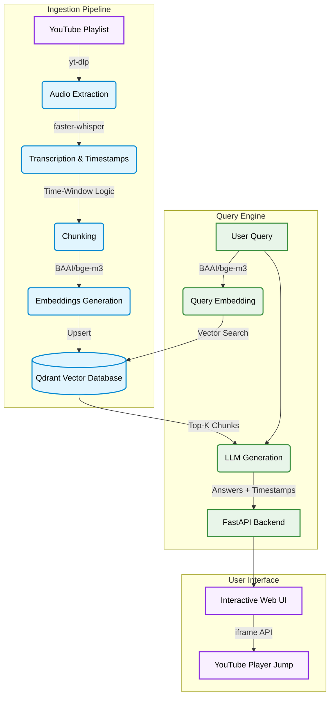

<div align="center">

# Youtube-Scrapper

**Retrieval over a YouTube playlist. A student asks a question and gets an answer plus clickable links that jump to the exact second in the exact video.**

[](https://fastapi.tiangolo.com/)
[](https://groq.com/)
[](https://qdrant.tech/)
[](https://github.com/SYSTRAN/faster-whisper)
[](https://www.python.org/)

</div>

---

## Overview

Developed a Retrieval-Augmented Generation (RAG) system capable of analyzing vast YouTube playlists to extract grounded answers linked to precise video timestamps. Features custom BAAI/bge-m3 embeddings for Hinglish queries, an optimized Qdrant vector database, and fault-tolerant asynchronous batched video transcription utilizing Faster-Whisper.

---

## Architecture Overview



---

## Features

| Component | Description |
|---|---|
| **Precise Timestamp Jumping** | Citations call `player.seekTo()` on the embedded YouTube iframe, so clicking a source jumps inside the page rather than opening a new tab. |
| **GPU-Optimized Transcription** | Uses `faster-whisper` (CTranslate2) with batched inference to transcribe 68+ hours of video in ~8 hours. |
| **Idempotent Ingestion** | Network drops or power cuts are survived safely. Re-running the ingest command resumes exactly where it left off, avoiding duplicate processing. |
| **Stateless Deployment** | The Qdrant index is cloud-hosted and transcripts are committed to the repo, meaning the production deploy needs no persistent disk storage. |
| **Pre-computed Transcripts** | The expensive transcription step is paid once. The generated JSON transcripts (~1.4 KB per minute of video) are committed so others can build the search engine in seconds locally. |

---

## Technology Stack

| Component | Technologies |
|:---|:---|
| **Audio Extraction** | `yt-dlp`, `PyAV` |
| **Transcription** | `faster-whisper` |
| **Embeddings** | `sentence-transformers`, `BAAI/bge-m3` |
| **Vector Database** | `Qdrant Cloud` |
| **LLM** | `Groq` |
| **CLI & Tools** | `typer`, `rich`, `uv` |
| **API & Serving** | `FastAPI`, `uvicorn` |
| **Frontend** | Vanilla HTML/JS, YouTube IFrame API |

---

## Project Structure

```text
Youtube-Scrapper/
├── api/
│   ├── static/               # HTML UI with YouTube IFrame API
│   └── main.py               # FastAPI application backend
├── eval/
│   └── golden.json           # Evaluation golden set (Hits/Refusals)
├── transcripts/              # Pre-computed transcription JSONs
├── ytrag/
│   ├── answer.py             # LLM response logic
│   ├── chunk.py              # Time-window chunking algorithms
│   ├── cli.py                # Typer CLI application 
│   ├── config.py             # Environment configuration
│   ├── embed.py              # SentenceTransformer model wrapper
│   ├── evaluate.py           # Evaluation pipeline
│   ├── index.py              # Qdrant upsert/search logic
│   ├── playlist.py           # yt-dlp metadata extraction
│   └── transcribe.py         # faster-whisper inference
├── pyproject.toml            # Dependencies and metadata
├── uv.lock                   # Lockfile managed by uv
└── README.md                 # Project documentation
```

---

## Setup & Execution

### 1. Environment Initialization
```bash
git clone https://github.com/Shashank17singh/Youtube-Scrapper.git
cd Youtube-Scrapper
uv venv --python 3.11
uv sync
```
*(Optional for Windows GPU users)*: `uv sync --extra cuda`

### 2. Environment Variables
Keys come from the repository root `.env`. Create an `.env` file and set your keys:
```
GROQ_API_KEY=your_groq_key
QDRANT_URL=your_qdrant_url
QDRANT_API_KEY=your_qdrant_key
YTRAG_LLM_BACKEND=groq
YTRAG_ROOT=.
```

### 3. Running the App
Since the expensive transcripts are already bundled in the `/transcripts` folder, you don't need to re-transcribe. You only need to build the local index from them.
```bash
uv run ytrag reindex
uv run ytrag serve
```
Then navigate to `http://127.0.0.1:8000`.

### 4. Ingesting New Playlists (Optional)
If you wish to ingest a brand new playlist from scratch:
```bash
uv run ytrag ingest --playlist "<PLAYLIST_URL>"
```

---

## Deployment
This project is configured to run effortlessly on platforms like Render or Railway.
- Connect your GitHub repository.
- **Build Command:** `curl -LsSf https://astral.sh/uv/install.sh | sh && /opt/render/project/.cargo/bin/uv sync`
- **Start Command:** `uvicorn api.main:app --host 0.0.0.0 --port $PORT`
- *Make sure to populate your Environment Variables (`GROQ_API_KEY`, `QDRANT_URL`, `QDRANT_API_KEY`, `YTRAG_ROOT=.`) in your hosting dashboard.*
